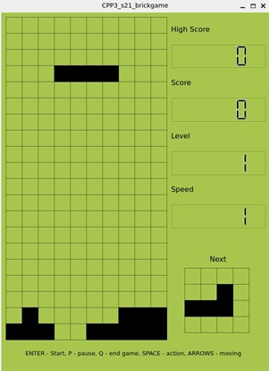
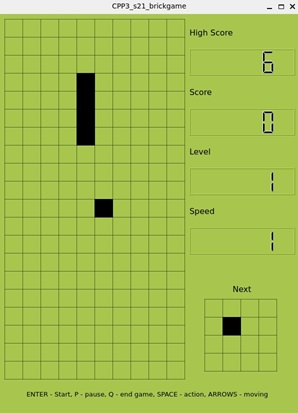

# Snake_CPP_BrickGame
Educational project - implementation of Tetris (C) and Snake (CPP) with console and QT versions 

Clone this repo and run `make`  

Needed - QT version 6.2.4 min  

Other target with `make ...`:  
- `dvi` - make program documentation (see index.html in "html"-folder);
- `dist`- make distibution (.tgz archive);
- `tests` - run tests for custom functions.

# Tetris

  

Tetris is a puzzle video game created in 1985 by Alexey Pajitnov, a Soviet software engineer. It has been published by several companies for multiple platforms, most prominently during a dispute over the appropriation of the rights in the late 1980s. After a significant period of publication by Nintendo, in 1996 the rights reverted to Pajitnov, who co-founded the Tetris Company with Henk Rogers to manage licensing.

# Main information

## Use your keyboard:

`Enter` - Start  
`P` - Pause  
`Q` - Quit  
`Left arrow` - Move left  
`Right arrow` - Move right  
`Down arrow` - falling down to the bottom  
`Spacebar` - Action (Rotation)  

## Scores

- 1 row is 100 points
- 2 rows is 300 points
- 3 rows is 700 points
- 4 rows is 1500 points

## Levels and game speed

Each time You gain 600 points, the level increases by 1.
Increasing the level boosts the speed at which the pieces move.
The maximum number of levels is 10.

# Snake

  

Snake is a genre of action video games where the player maneuvers the end of a growing line, often themed as a snake.
The player must keep the snake from colliding with both other obstacles and itself, which gets harder as the snake lengthens. It originated in the 1976 two-player arcade video game Blockade from Gremlin Industries where the goal is to survive longer than the other player. The concept evolved into a single-player variant where a snake gets longer with each piece of food eaten—often apples or eggs. The simplicity and low technical requirements of snake games have resulted in hundreds of versions—some of which have the word snake or worm in the title—for many platforms.

## Use your keyboard:

`Enter` - Start  
`P` - Pause  
`Q` - Quit  
`Left arrow` - Turn left  
`Right arrow` - Turn right  
`Down arrow` - Turn down  
`Up arrow` - Turn up  
`Spacebar` - Action (Speed up)  

## Scores

- 1 apple is 1 point

## Levels and game speed

Each time You gain 5 points, the level increases by 1.
Increasing the level boosts the speed at which the snake moves.
The maximum number of levels is 10.  
If You get 200 points You win - it's end of the game.
